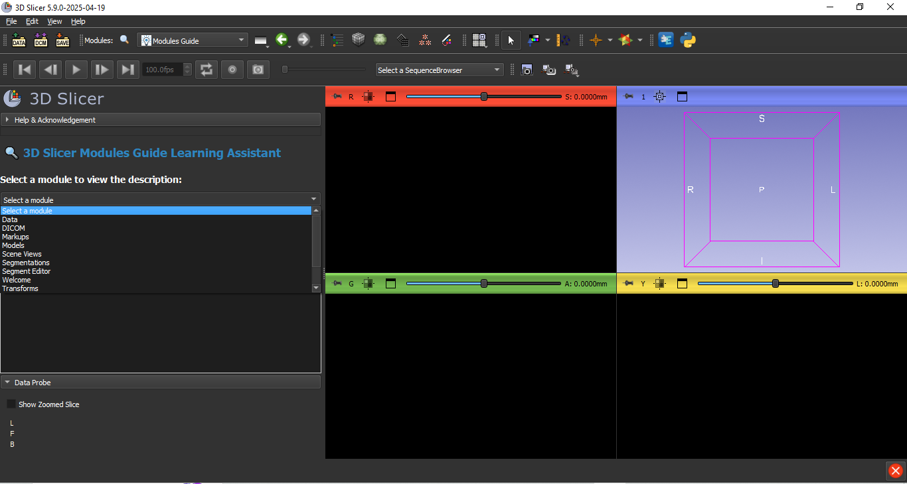
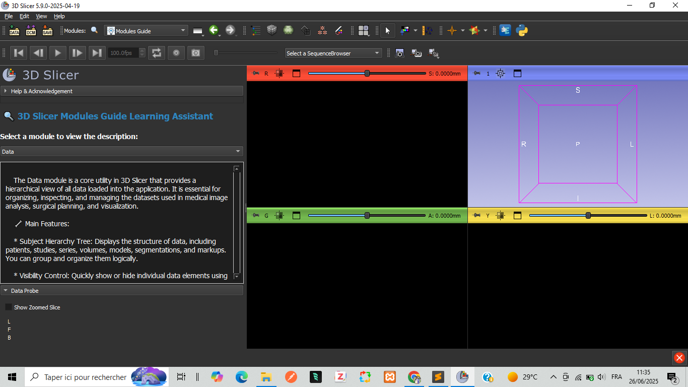

# 📘 3D Slicer Modules Guide Learning Assistant

**An interactive learning tool for beginners exploring 3D Slicer's powerful modules.**

<!--  -->

## 🧠 What is this?

**Modules Guide** is a Python-only extension for [3D Slicer](https://www.slicer.org/) that helps newcomers—students, researchers, or developers—understand and explore key modules in Slicer. It provides interactive, easy-to-read documentation directly within the Slicer interface.

## 🧰 Features

- 🔍 Select a module from a dropdown list
- 📚 View rich, well-formatted descriptions
- 🌙 Dark-themed text browser for comfortable reading
- 🔁 Pure Python implementation—no external dependencies

---

## 📸 Interface Screenshot

> Here's how the module appears inside Slicer:

<!-- 
---

## 🎬 Demo Video

Watch a short demo of the tool in action:  

> *(Replace `VIDEO_ID_HERE` with your YouTube video ID)*
 -->
---

## 📘 Included Modules

This guide includes descriptions for the following Slicer modules:

- Data  
- DICOM  
- Markups  
- Models  
- Scene Views  
- Segmentations  
- Segment Editor
- Welcome  
- Transforms  
- View Controllers  
- Volume Rendering  
- Volumes

---

## 🧪 Installation

1. Download or clone this repository.
2. Copy the `ModulesGuide` directory to your Slicer Extensions folder.
3. Restart Slicer.
4. Find it in the module list under: **Utilities > Modules Guide**

---

## 📚 Learning Resources

- 📘 [3D Slicer Training Portal](https://www.slicer.org/wiki/Documentation/Nightly/Training)
- 📖 [Module Development Guide](https://slicer.readthedocs.io/en/latest/developer_guide/scripted_loadable_module.html)
- 💬 [Slicer Community Forum](https://discourse.slicer.org/)

---

## 👤 Author

**Mohamed Alalli Bilal**  
Software Engineer | 3D Slicer Internationalization Lead Developer in Mauritania  — Mauritania  
📬 [LinkedIn Profile](https://www.linkedin.com/in/mohamed-alalli-bilal-a2a942202/)

---

## 📜 License

This tool is open-source and intended for educational use.  
Feel free to modify and reuse — attribution appreciated.

---

## 🙏 Acknowledgement

Created as a personal training project using Python only.  
Special thanks to the global [3D Slicer community](https://discourse.slicer.org/) for making powerful open tools freely available.
